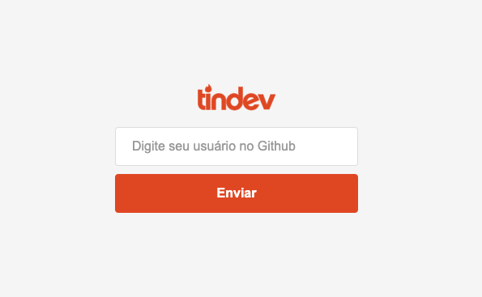
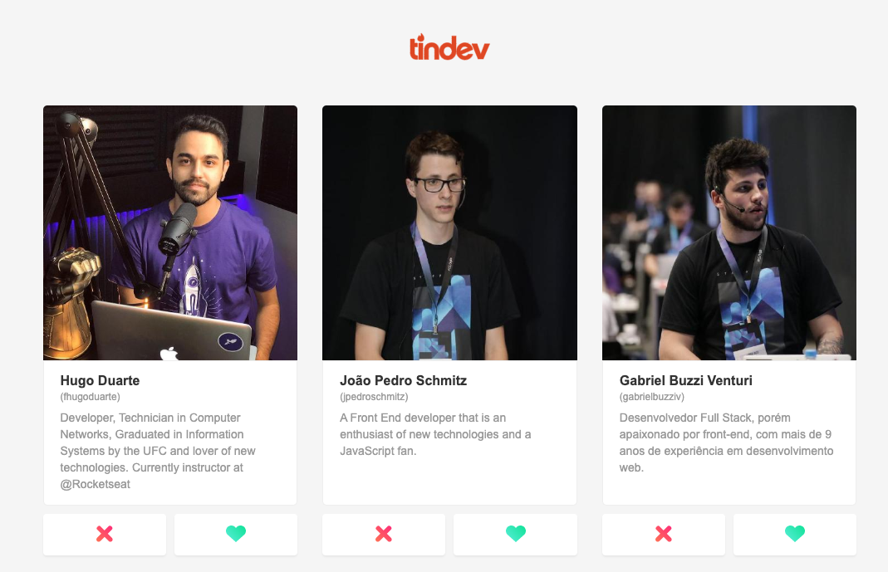

<!-- Info Header -->
<table>
  <tr>
    <td>
      
    </td>
    <td>
      <h3>
        Projeto criado na semana de Treinamento da Semana Omnistack
      </h3>
      
Pequena aplicação criada usando NodeJs no backend e ReactJs no frontend.

      

        
        
      

      <p">
        <a href="#telas-do-sistema">Telas do Sistema</a>&nbsp;&nbsp;&nbsp;|&nbsp;&nbsp;&nbsp;
        <a href="#descrição">Descrição</a>
      

    </td>
  </tr>
</table>

#### Telas do Sistema

    

    

---

#### Descrição

Pequena aplicação criada usando NodeJs no backend e ReactJs no frontend.
Foi utilizado a API do Github, Mongo, Websocket.
